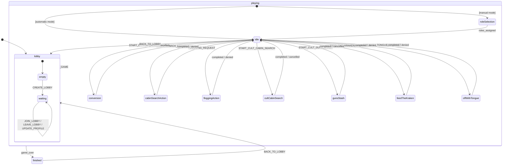

# Data Model: XState V5 Game Machine

**Feature**: XState v5 Migration  
**Date**: 2026-01-03

## Overview

This document describes the XState v5 state machine data model for the Feed the Kraken companion app.

---

## GameContext (Machine Context)

The context holds all mutable game data that persists across state transitions.

```typescript
interface GameContext {
  // Room identification
  code: string;
  
  // Player management
  players: Player[];
  
  // Role management
  roleDistributionMode: "automatic" | "manual";
  roleSelectionStatus?: RoleSelectionStatus;
  assignments?: Record<string, Role>;
  originalRoles?: Record<string, Role>;
  
  // Game tracking
  isFloggingUsed: boolean;
  conversionCount: number;
  
  // Active action state (only one active at a time)
  conversionStatus?: ConversionStatus;
  cabinSearchStatus?: CabinSearchStatus;
  gunsStashStatus?: GunsStashStatus;
  feedTheKrakenResult?: FeedTheKrakenResult;
  
  // Snapshot for game reset
  initialGameState?: InitialGameState;
}
```

---

## State Hierarchy



---

## Entity Definitions

### Player

```typescript
interface Player {
  id: string;
  name: string;
  photoUrl: string | null;
  isHost: boolean;
  isReady: boolean;
  isOnline: boolean;
  isEliminated: boolean;
  isUnconvertible: boolean;
  notRole: Role | null;
  joinedAt: number;
  hasTongue: boolean;
}
```

### Role

```typescript
type Role = "SAILOR" | "PIRATE" | "CULT_LEADER" | "CULTIST";
```

### RoleSelectionStatus (Manual Mode)

```typescript
interface RoleSelectionStatus {
  state: "SELECTING" | "COMPLETED" | "CANCELLED";
  availableRoles: Role[];
  selections: Record<string, { role: Role; confirmed: boolean }>;
  cancellationReason?: string;
}
```

### ConversionStatus

```typescript
interface ConversionStatus {
  initiatorId: string;
  responses: Record<string, boolean>;
  state: "PENDING" | "ACTIVE" | "COMPLETED" | "CANCELLED";
  round?: {
    startTime: number;
    duration: number;
    playerQuestions: Record<string, number>;
    leaderChoice: string | null;
    playerAnswers: Record<string, string>;
    result?: {
      convertedPlayerId: string | null;
      correctAnswers: string[];
    };
  };
}
```

### CabinSearchStatus

```typescript
interface CabinSearchStatus {
  initiatorId: string;
  claims: Record<string, CabinRole>;
  state: "SETUP" | "ACTIVE" | "COMPLETED" | "CANCELLED";
  cancellationReason?: string;
  startTime?: number;
  playerQuestions?: Record<string, number>;
  playerAnswers?: Record<string, string>;
  result?: { correctAnswers: string[] };
}

type CabinRole = "CAPTAIN" | "NAVIGATOR" | "LIEUTENANT" | "CREW";
```

### GunsStashStatus

```typescript
interface GunsStashStatus {
  initiatorId: string;
  state: "WAITING_FOR_PLAYERS" | "DISTRIBUTION" | "COMPLETED" | "CANCELLED";
  readyPlayers: string[];
  startTime?: number;
  distribution?: Record<string, number>;
  playerQuestions?: Record<string, number>;
  playerAnswers?: Record<string, string>;
  results?: { correctAnswers: string[] };
  cancellationReason?: string;
}
```

### FeedTheKrakenResult

```typescript
interface FeedTheKrakenResult {
  targetPlayerId: string;
  cultVictory: boolean;
}
```

---

## XState Events

All events sent to the machine. Maps 1:1 with existing WebSocket message types.

```typescript
type GameEvent =
  // Lobby events
  | { type: "CREATE_LOBBY"; playerId: string; playerName: string; playerPhoto: string | null }
  | { type: "JOIN_LOBBY"; playerId: string; playerName: string; playerPhoto: string | null }
  | { type: "UPDATE_PROFILE"; playerId: string; name: string; photoUrl: string | null }
  | { type: "LEAVE_LOBBY"; playerId: string }
  | { type: "ADD_BOT" }
  | { type: "SET_ROLE_DISTRIBUTION_MODE"; mode: "automatic" | "manual" }
  
  // Game start events
  | { type: "START_GAME"; playerId: string }
  | { type: "SELECT_ROLE"; playerId: string; role: Role }
  | { type: "CONFIRM_ROLE"; playerId: string }
  | { type: "CANCEL_ROLE_SELECTION"; playerId: string }
  
  // Captain actions
  | { type: "DENIAL_OF_COMMAND"; playerId: string }
  | { type: "CABIN_SEARCH_REQUEST"; targetPlayerId: string }
  | { type: "CABIN_SEARCH_RESPONSE"; searcherId: string; confirmed: boolean }
  | { type: "FLOGGING_REQUEST"; targetPlayerId: string }
  | { type: "FLOGGING_CONFIRMATION_RESPONSE"; hostId: string; confirmed: boolean }
  
  // Conversion events
  | { type: "START_CONVERSION"; initiatorId: string }
  | { type: "RESPOND_CONVERSION"; playerId: string; accept: boolean }
  | { type: "SUBMIT_CONVERSION_ACTION"; playerId: string; action: "PICK_PLAYER" | "ANSWER_QUIZ"; targetId?: string; answer?: string }
  
  // Cult cabin search events
  | { type: "START_CULT_CABIN_SEARCH"; initiatorId: string }
  | { type: "CLAIM_CULT_CABIN_SEARCH_ROLE"; playerId: string; role: CabinRole }
  | { type: "CANCEL_CULT_CABIN_SEARCH"; playerId: string }
  | { type: "SUBMIT_CULT_CABIN_SEARCH_ACTION"; playerId: string; answer: string }
  
  // Guns stash events
  | { type: "START_CULT_GUNS_STASH"; initiatorId: string }
  | { type: "CONFIRM_CULT_GUNS_STASH_READY"; playerId: string }
  | { type: "SUBMIT_CULT_GUNS_STASH_DISTRIBUTION"; playerId: string; distribution: Record<string, number> }
  | { type: "SUBMIT_CULT_GUNS_STASH_ACTION"; playerId: string; answer: string }
  | { type: "CANCEL_CULT_GUNS_STASH"; playerId: string }
  
  // Feed the kraken events
  | { type: "FEED_THE_KRAKEN_REQUEST"; targetPlayerId: string }
  | { type: "FEED_THE_KRAKEN_RESPONSE"; captainId: string; confirmed: boolean }
  
  // Off with tongue events
  | { type: "OFF_WITH_TONGUE_REQUEST"; targetPlayerId: string }
  | { type: "OFF_WITH_TONGUE_RESPONSE"; captainId: string; confirmed: boolean }
  
  // Game management events
  | { type: "RESET_GAME" }
  | { type: "BACK_TO_LOBBY" }
  
  // Internal events (for connection management)
  | { type: "PLAYER_DISCONNECTED"; playerId: string }
  | { type: "PLAYER_RECONNECTED"; playerId: string };
```

---

## Invariants & Validation Rules

1. **Player Count**: 5-11 players required to start
2. **Role Composition**: Must match valid composition for player count
3. **Single Active Action**: Only one action flow active at a time in `playing.idle`
4. **Host Authority**: Only host can start game, reset to lobby
5. **Cult Actions**: Only cult members can initiate cult-specific actions
6. **Conversion Limit**: Maximum conversions limited by game rules
