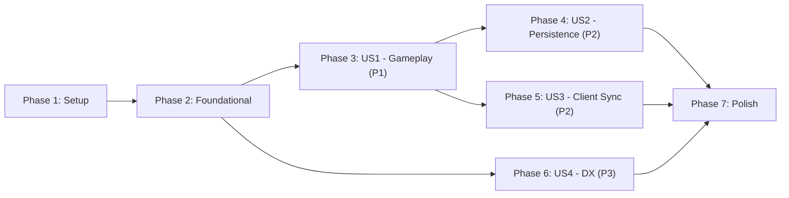

# Tasks: XState V5 Migration

**Input**: Design documents from `/specs/001-xstate-v5-migration/`
**Prerequisites**: plan.md ✓, spec.md ✓, research.md ✓, data-model.md ✓, contracts/ ✓, quickstart.md ✓

**Tests**: Tests are NOT explicitly requested. Existing unit tests will be migrated; E2E tests should pass without modification.

**Organization**: Tasks organized by user story for independent implementation and testing.

## Format: `[ID] [P?] [Story] Description`

- **[P]**: Can run in parallel (different files, no dependencies)
- **[Story]**: Which user story this task belongs to (e.g., US1, US2, US3)
- Include exact file paths in descriptions

---

## Phase 1: Setup (Shared Infrastructure)

**Purpose**: Install XState v5 and create project structure

- [X] T001 Install XState v5 dependency: `npm install xstate@5`
- [X] T002 Create `party/machine/` directory structure for XState code
- [X] T003 [P] Copy type contracts from `specs/001-xstate-v5-migration/contracts/game-machine.types.ts` to `party/machine/types.ts`

---

## Phase 2: Foundational (Blocking Prerequisites)

**Purpose**: Core XState machine definition that ALL user stories depend on

**⚠️ CRITICAL**: No user story work can begin until this phase is complete

- [X] T004 Define gameMachine setup with `setup()` in `party/machine/gameMachine.ts`
- [X] T005 [P] Implement core guards in `party/machine/guards.ts`: `isHost`, `hasMinPlayers`, `isValidPlayerCount`, `isPlayerInGame`
- [X] T006 [P] Implement lobby actions in `party/machine/actions.ts`: `addPlayer`, `removePlayer`, `updateProfile`, `addBot`, `setRoleDistributionMode`
- [X] T007 Implement lobby states in `party/machine/gameMachine.ts`: `lobby.empty`, `lobby.waiting` with transitions
- [X] T008 Implement role assignment action in `party/machine/actions.ts`: `assignRoles` (automatic mode)
- [X] T009 Implement role selection states and actions for manual mode in `party/machine/actions.ts`: `selectRole`, `confirmRole`, `cancelRoleSelection`
- [X] T010 Implement game action states in `party/machine/gameMachine.ts`: `playing.idle`, all action sub-states (conversion, cabinSearch, flogging, etc.)
- [X] T011 [P] Implement conversion actions in `party/machine/actions.ts`: `startConversion`, `respondConversion`, `submitConversionAction`
- [X] T012 [P] Implement cabin search actions in `party/machine/actions.ts`: `cabinSearchRequest`, `cabinSearchResponse`, and cult cabin search actions
- [X] T013 [P] Implement guns stash actions in `party/machine/actions.ts`: `startGunsStash`, `confirmReady`, `submitDistribution`, `submitAnswer`
- [X] T014 [P] Implement flogging actions in `party/machine/actions.ts`: `floggingRequest`, `floggingConfirmationResponse`
- [X] T015 [P] Implement feed the kraken actions in `party/machine/actions.ts`: `feedTheKrakenRequest`, `feedTheKrakenResponse`
- [X] T016 [P] Implement off with tongue actions in `party/machine/actions.ts`: `offWithTongueRequest`, `offWithTongueResponse`
- [X] T017 Implement game management actions in `party/machine/actions.ts`: `resetGame`, `backToLobby`
- [X] T018 [P] Implement connection actions in `party/machine/actions.ts`: `playerDisconnected`, `playerReconnected`
- [X] T019 Wire all actions and guards into gameMachine `setup()` configuration in `party/machine/gameMachine.ts`
- [X] T020 Export gameMachine from `party/machine/index.ts` barrel file

**Checkpoint**: Foundation ready - XState machine definition complete

---

## Phase 3: User Story 1 - Seamless Gameplay Experience (Priority: P1) 🎯 MVP

**Goal**: Players can complete full game flows with XState-managed state, maintaining the same UX as current implementation.

**Independent Test**: Complete a full game flow (join → start → roles → actions → end) without behavioral differences.

### Implementation for User Story 1

- [X] T021 [US1] Replace `lobbyState: LobbyState | null` with `gameActor: Actor<typeof gameMachine>` in `party/index.ts`
- [X] T022 [US1] Update `onStart()` in `party/index.ts` to create XState actor (without persistence initially)
- [X] T023 [US1] Update `onMessage()` in `party/index.ts` to forward events to actor: `this.gameActor.send(data)`
- [X] T024 [US1] Subscribe to actor state changes and broadcast snapshots in `party/index.ts`
- [X] T025 [US1] Update `onConnect()` in `party/index.ts` to send current snapshot to connecting client
- [X] T026 [US1] Migrate unit tests to test XState machine in `party/*.test.ts` (update `conversion.test.ts`, `cult_cabin_search.test.ts`, etc.)

**Checkpoint**: User Story 1 complete - gameplay works through XState, verify with E2E tests

---

## Phase 4: User Story 2 - State Persistence and Recovery (Priority: P2)

**Goal**: Game state persists across server restarts; players can reconnect and resume.

**Independent Test**: Restart PartyKit server mid-game and verify state recovery.

### Implementation for User Story 2

- [X] T027 [US2] Implement snapshot persistence: save `getPersistedSnapshot()` to `room.storage.put("gameSnapshot", snapshot)` in `party/index.ts`
- [X] T028 [US2] Update `onStart()` in `party/index.ts` to rehydrate actor from storage: `createActor(gameMachine, { snapshot })`
- [X] T029 [US2] Determine significant transitions that trigger persistence (state entry, context mutation) in `party/index.ts`
- [X] T030 [US2] Verify persistence with manual test: create lobby, restart server, reconnect

**Checkpoint**: User Story 2 complete - state persists across restarts

---

## Phase 5: User Story 3 - Consistent State Across All Clients (Priority: P2)

**Goal**: All clients receive identical state snapshots; server is single source of truth.

**Independent Test**: Connect 5 clients, perform actions, verify all show identical state.

### Implementation for User Story 3

- [X] T031 [US3] Update broadcast logic in `party/index.ts` to use `STATE_UPDATE` message type with XState snapshot format
- [X] T032 [US3] Update `app/context/GameContext.tsx` message listener to handle `STATE_UPDATE` instead of `LOBBY_UPDATE` and store the `snapshot`
- [X] T033 [US3] Simplify `GameContext.tsx` to derive all values from snapshot (myRole, canStartGame, etc.) - Implemented `useGameHandlers` hook
- [X] T034 [US3] Remove duplicated state calculation logic from `GameContext.tsx` - Handlers logic extracted to hook
- [X] T035 [US3] Update React components to consume snapshot-derived values - Verified (components use GameContext which provides snapshot data)
- [X] T036 [US3] Verify line count reduction in `GameContext.tsx` (target: <500 lines) - Reduced from 1092 to 742 lines

**Checkpoint**: User Story 3 complete - all clients in sync via snapshots

---

### Phase 5.5: Refactor Flogging State (User Feedback)
- [X] T037 [US3] Refactor `floggingReveal` in `GameContext.tsx` to be derived from `lobby.floggingStatus` instead of local state events - Implemented derivation and local dismissal persistence

### Phase 5.9: Legacy Code Cleanup (User Request)
- [X] T037.1 Remove `convertSnapshotToLobbyState` and `LOBBY_UPDATE` message support from server and client - Complete "big bang" refactor

### Phase 5.6: Refine Flogging State Ownership (User Request)
- [X] T037.2 Refactor `floggingConfirmationPrompt` to be derived from `lobby.floggingStatus` instead of local state - Ensure full server ownership
- [X] T037.3 Refactor `captainCabinSearchStatus` to be part of `LobbyState` and derived on client - Ensure full server ownership

### Phase 6: User Story 4 - Developer Experience: Clearer State Logic (Priority: P3)

**Goal**: XState machine structure makes game logic explicit and maintainable.

**Independent Test**: Developers can trace action flows by reading machine definition.

### Implementation for User Story 4

- [ ] T038 [US4] Add JSDoc comments to gameMachine states explaining state purpose and valid transitions in `party/machine/gameMachine.ts`
- [ ] T039 [US4] Add JSDoc comments to guards explaining validation rules in `party/machine/guards.ts`
- [ ] T039 [US4] Add JSDoc comments to actions explaining state mutations in `party/machine/actions.ts`
- [ ] T040 [US4] Update `specs/001-xstate-v5-migration/quickstart.md` with actual file paths and patterns post-implementation

**Checkpoint**: User Story 4 complete - machine well-documented

---

## Phase 7: Polish & Cross-Cutting Concerns

**Purpose**: Final verification and cleanup across all stories

- [ ] T041 [P] Run all E2E tests: `npm run test:e2e` - verify no regressions (SC-001)
- [ ] T042 [P] Run all unit tests: `npm run test:unit` - verify all pass (SC-002)
- [ ] T043 Verify state sync latency <500ms (SC-003) via manual test with 5 clients
- [ ] T044 Verify state restoration <2s after restart (SC-004) via manual test
- [ ] T045 Final line count verification for `GameContext.tsx` reduction (SC-006)
- [ ] T046 [P] Remove deprecated code and unused handlers from `party/index.ts`
- [ ] T047 Update `app/types.ts` to import shared types from contracts

---

## Dependencies & Execution Order

### Phase Dependencies

- **Setup (Phase 1)**: No dependencies - can start immediately
- **Foundational (Phase 2)**: Depends on Setup (Phase 1) completion - BLOCKS all user stories
- **User Story 1 (Phase 3)**: Depends on Foundational (Phase 2) completion (MVP)
- **User Story 2 (Phase 4)**: Depends on User Story 1 (Phase 3) completion
- **User Story 3 (Phase 5)**: Depends on User Story 1 (Phase 3) completion (can parallel with US2)
- **User Story 4 (Phase 6)**: Can start after Foundational (Phase 2) - documentation task
- **Polish (Phase 7)**: Depends on all user stories being complete

### User Story Dependencies



### Within Each Phase

- Guards and actions before machine definition
- Machine definition before server integration
- Server integration before client updates
- Core implementation before tests

### Parallel Opportunities

- **Phase 2**: T005, T006 can run in parallel; T011-T016, T018 can run in parallel
- **Phase 5 & 6**: US3 and US4 can be worked in parallel after US1
- **Phase 7**: T041, T042, T046 can run in parallel

---

## Parallel Example: Phase 2 Foundational

```bash
# Launch all guard and action files in parallel:
Task: "Implement core guards in party/machine/guards.ts"
Task: "Implement lobby actions in party/machine/actions.ts"

# After guards/actions complete, launch action-specific implementations:
Task: "Implement conversion actions in party/machine/actions.ts"
Task: "Implement cabin search actions in party/machine/actions.ts"
Task: "Implement guns stash actions in party/machine/actions.ts"
Task: "Implement flogging actions in party/machine/actions.ts"
Task: "Implement feed the kraken actions in party/machine/actions.ts"
Task: "Implement off with tongue actions in party/machine/actions.ts"
Task: "Implement connection actions in party/machine/actions.ts"
```

---

## Implementation Strategy

### MVP First (User Story 1 Only)

1. Complete Phase 1: Setup
2. Complete Phase 2: Foundational (CRITICAL - blocks all stories)
3. Complete Phase 3: User Story 1
4. **STOP and VALIDATE**: Run `npm run test:e2e` - all tests should pass
5. Deploy/demo if ready - gameplay works through XState

### Incremental Delivery

1. Complete Setup + Foundational → XState machine defined
2. Add User Story 1 → Test independently → Deploy (MVP!)
3. Add User Story 2 → Persistence works → Deploy
4. Add User Story 3 → Client simplified → Deploy
5. Add User Story 4 → Documentation complete → Deploy

---

## Notes

- [P] tasks = different files, no dependencies
- [Story] label maps task to specific user story for traceability
- Existing E2E tests are the primary validation (18 tests)
- Target: `GameContext.tsx` from 1052 lines to <500 lines (50%+ reduction)
- XState v5 persistence via `getPersistedSnapshot()` / `createActor(machine, { snapshot })`
- Avoid changing WebSocket message types where possible (preserve client compatibility)
